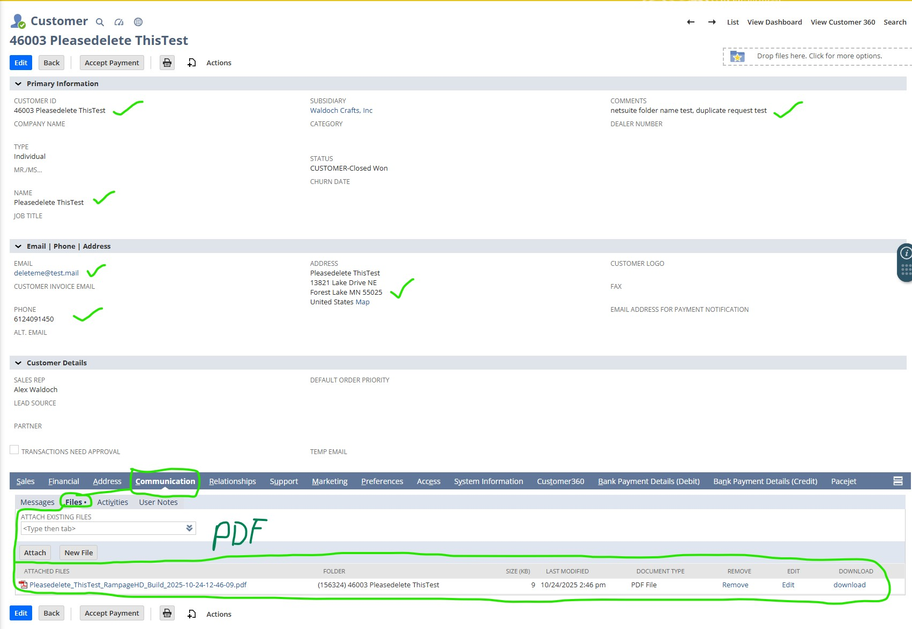
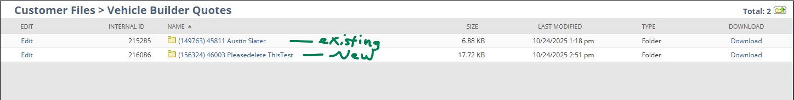
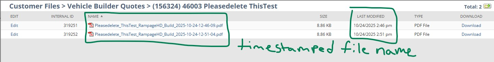

# Vehicle Builder RESTlet

## Overview

This RESTlet handles customer creation and file attachment workflows for Vehicle Builder submissions.  
It allows an external web form or integration to send customer details and a base64-encoded PDF quote directly to NetSuite.

When called via HTTP **POST**, the RESTlet:

1. Finds or creates a Customer record (based on email).
2. Adds or updates address and contact information.
3. Uploads a PDF quote into the File Cabinet under `/Vehicle Builder Quotes/(CustomerID) Customer Name/`.
4. Attaches the uploaded file to the Customer record under Communication → Files.
5. Ensures each uploaded file has a unique timestamped name to prevent collisions.

---

## Screenshots
Here is a visual representation of all the processing this RESTlet achieves.




## Script Information

| Property | Value |
|-----------|--------|
| Script Type | RESTlet |
| API Version | 2.1 |
| Filename | `vehicleBuilder.js` |
| Module Dependencies | `N/record`, `N/search`, `N/file`, `N/log` |

---

## Setup Instructions

### 1. Create Base Folder

Before deploying, ensure a base folder exists in the File Cabinet:
`/Vehicle Builder Quotes`


This script assumes this folder exists.  
All customer-specific folders will be created under it automatically.

### 2. Upload Script File

1. Go to **Customization → Scripting → Scripts → New**.
2. Upload this file (`vehicleBuilder.js`) to the File Cabinet.
3. Choose **Script Type → RESTlet**.
4. Complete the script record details and **Deploy** it.

### 3. Deployment

- Navigate to the **Script Deployment** record.
- Set **Status** to `Released`.
- Copy the **External URL** (this will be the endpoint your form or integration calls).

---

## Request Structure (POST)

**HTTP Method:**  
`POST`

**Content-Type:**  
`application/json`

### Body Example

```json
{
  "first_name": "John",
  "last_name": "Smith",
  "email": "john.smith@example.com",
  "phone": "555-123-4567",
  "address": "1234 Main Street",
  "city": "Denver",
  "state": "CO",
  "zip": "80202",
  "country": "US",
  "message": "Interested in Model X configuration.",
  "file": {
    "name": "vehicle_quote.pdf",
    "content": "JVBERi0xLjQKJaqrrK0KNCAwIG9iago8PAov..."
  }
}
```

### File Object Details
| Field          | Description                    |
| -------------- | ------------------------------ |
| `file.name`    | File name (e.g., `quote.pdf`). |
| `file.content` | Base64-encoded PDF content.    |


### Behavior Sumamry
| Action                 | Behavior                                                             |
| ---------------------- | -------------------------------------------------------------------- |
| Customer exists        | Record is loaded and updated.                                        |
| Customer doesn’t exist | A new record is created.                                             |
| Folder exists          | Reused (no overwrite).                                               |
| Folder doesn’t exist   | Created dynamically as `(CustomerID) Customer Name`.                 |
| File upload            | PDF saved in the customer’s folder under `/Vehicle Builder Quotes/`. |
| File naming            | Unique name generated with timestamp (`_YYYY-MM-DD-HH-MM-SS.pdf`).   |
| Attachment             | File is attached to the customer under Communication → Files.        |
| Error handling         | Errors are logged to the Execution Log (`log.error`).                |

### Example Folder Structure
```arduino
/File Cabinet
 └── Vehicle Builder Quotes
      ├── (12345) John Smith
      │    ├── quote_2025-10-23-14-05-32.pdf
      │    ├── quote_2025-10-23-14-07-11.pdf
      │    └── quote_2025-10-24-09-23-58.pdf
      └── (12346) Jane Doe
           └── vehicle_quote_2025-10-22-12-44-05.pdf
```


### Developer Notes
- Each uploaded file receives a timestamp suffix to prevent duplicate names.
- The base folder Vehicle Builder Quotes must exist in the File Cabinet.
- Timestamps ensure collision-free file naming even for frequent submissions.
- All customer folder names are formatted as:

```scss
(CustomerID) Customer Name
```

- You can enhance uniqueness further by including milliseconds if required:
```js
const uniqueName = `${baseName}_${ts}_${now.getMilliseconds()}.pdf`;
```

### Example Sucess Response
```json
{
  "success": true,
  "customerId": "12345"
}
```

### Example Error Response
```json
{
  "success": false,
  "error": "Base folder \"Vehicle Builder Quotes\" not found in File Cabinet."
}
```

### Change Log
| Version | Date       | Description                                                    |
| ------- | ---------- | -------------------------------------------------------------- |
| 1.0.0   | 2025-10-23 | Initial version with timestamped file naming and folder reuse. |


### Author Notes
This RESTlet was designed for seamless integration between a Vehicle Builder Web Form and NetSuite.
It provides a robust, idempotent method to ensure customer data and associated quote PDFs are consistently stored, organized, and accessible inside NetSuite.