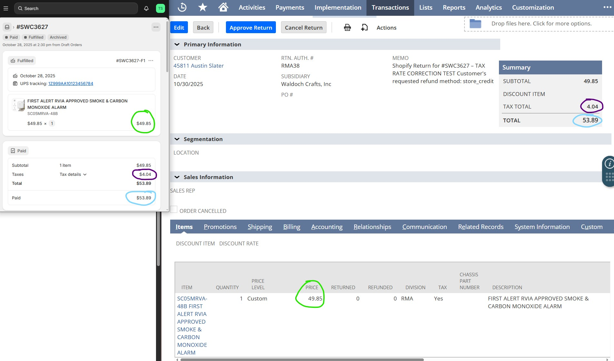

# Create Return Authorization

## Overview

This RESTlet is a NetSuite SuiteScript 2.1 script designed to handle POST requests for creating a Return Authorization (RA) record. It processes incoming data to generate an RA linked to a specific sales order, customer (identified by email), and a list of items to be returned. The script uses NetSuite's `N/record` module to create the record, `N/search` to lookup the customer, and `N/log` for error logging.

The RESTlet exposes a single endpoint method: `post`, which invokes the `createReturnAuthorization` function.

## Screenshots


## Purpose

The primary purpose of this RESTlet is to automate the creation of return authorizations in NetSuite. It is typically used in scenarios such as:
- Integrating with external systems (e.g., e-commerce platforms) to handle customer returns.
- Allowing customers to initiate returns via email-based identification without needing their internal customer ID.
- Ensuring returns are tied to an original order and include specific items with quantities and classifications.

This helps streamline return processing, reducing manual entry in the NetSuite UI.

## Input Data

The RESTlet expects a JSON payload (`data`) in the POST request with the following structure:

- **customerEmail** (string, required): The email address of the customer initiating the return. Used to lookup the customer's internal ID.
- **orderId** (string or number, required): The internal ID of the original sales order from which the return is created.
- **message** (string, optional): A memo or note to attach to the RA record. Defaults to an empty string if not provided.
- **items** (array of objects, required): A list of items to return. Each item object should include:
  - **itemId** (string or number, required): The internal ID of the item.
  - **quantity** (number, required): The quantity to return.
  - **class** (string, optional): The class for the item line (e.g., for accounting purposes). Defaults to 'RMA' if not specified.

Example JSON payload:
```json
{
  "customerEmail": "customer@example.com",
  "orderId": 12345,
  "message": "Defective product",
  "items": [
    {
      "itemId": 6789,
      "quantity": 2,
      "class": "Returns"
    },
    {
      "itemId": 1011,
      "quantity": 1
    }
  ]
}
```

## Functionality Breakdown

1. **Customer Lookup**:
   - Performs a search on the Customer record type using the provided `customerEmail`.
   - Filters: Email exactly matches `data.customerEmail`.
   - Retrieves the first matching customer's internal ID.
   - If no customer is found, throws an error: "Customer not found for email: [email]".

2. **Create Return Authorization Record**:
   - Uses `record.create` to instantiate a new dynamic Return Authorization record.
   - Sets top-level fields:
     - `entity`: The customer's internal ID.
     - `createdfrom`: The original order ID.
     - `memo`: The provided message (or empty).

3. **Add Item Lines**:
   - Iterates over each item in `data.items`.
   - For each item:
     - Selects a new line in the 'item' sublist.
     - Sets `item` to the item ID.
     - Sets `quantity` to the specified quantity.
     - Sets `class` to the provided class or defaults to 'RMA'.
     - Commits the line.

4. **Save and Return**:
   - Saves the record and captures the new RA's internal ID.
   - Returns a JSON response: `{ success: true, returnId: [ID] }`.
   - If an error occurs (e.g., invalid data, save failure), logs the error and returns: `{ success: false, message: [error message] }`.

## Error Handling

- Errors are caught in a try-catch block.
- Logs errors using `N/log.error` with title 'Return Creation Error'.
- Returns a failure response with the error message, ensuring the caller is informed without exposing sensitive details.

## Deployment and Usage

- **Script Type**: RESTlet (@NScriptType Restlet).
- **API Version**: 2.1 (@NApiVersion 2.1).
- To deploy: Upload this script to NetSuite as a RESTlet and note the deployment URL.
- Call via HTTP POST to the RESTlet URL with the JSON payload.
- Authentication: Requires NetSuite role-based access or token-based authentication for external calls.

## Potential Improvements or Considerations

- **Validation**: Add more input validation (e.g., check if orderId exists, validate item quantities).
- **Customization**: Extend to handle additional fields like location, department, or custom fields.
- **Security**: Ensure the RESTlet is secured; expose only to trusted integrations to prevent unauthorized returns.
- **Testing**: Test with sample data in NetSuite's sandbox to verify RA creation and sublist population.

This RESTlet provides a robust, automated way to manage returns in NetSuite, integrating seamlessly with other systems.