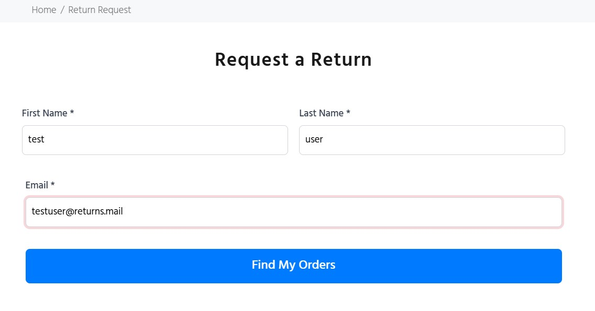
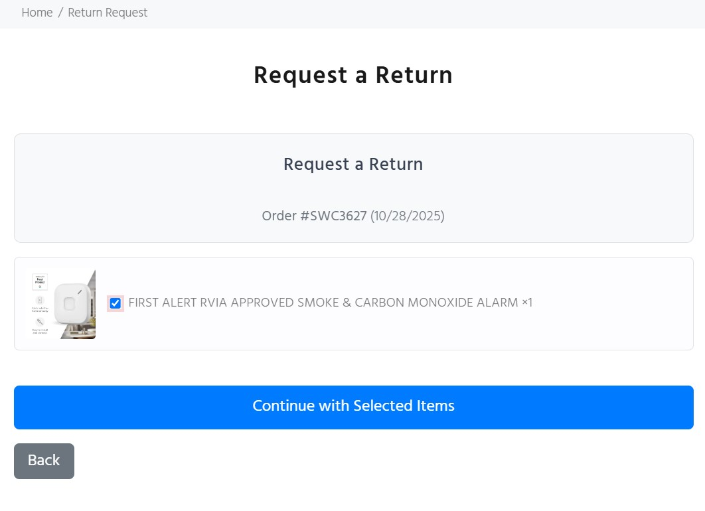
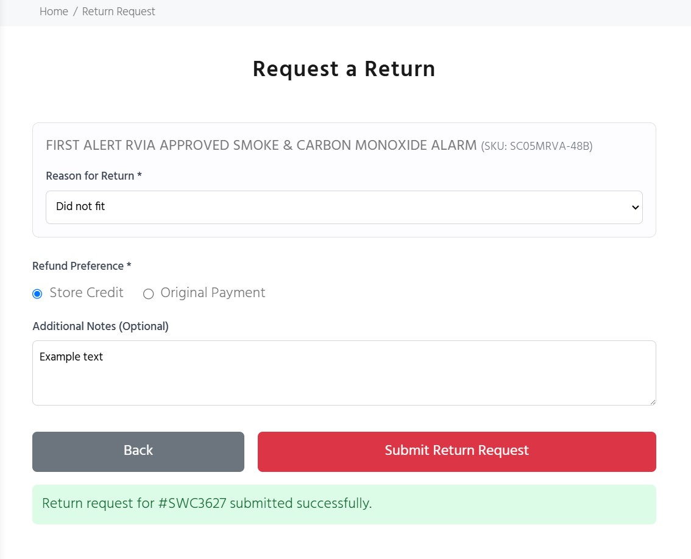
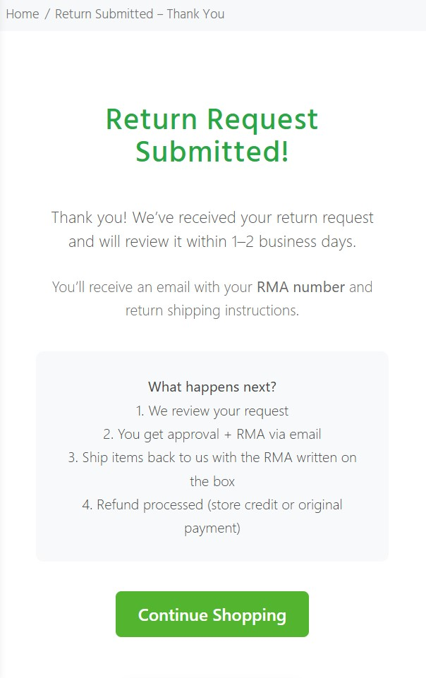

# Return Request Frontend Documentation

## Overview

This is a three-step return request system that allows customers to find their orders, select items to return, and submit return requests with reasons and refund preferences.

---

## User Flow

### Step 1: Customer Lookup
Customers enter their information to find eligible orders.



### Step 2: Order Selection
Customers view their recent orders and select items they want to return.



### Step 3: Return Details
Customers provide return reasons and refund preferences, then submit the request.




---

## Step-by-Step Breakdown

### **Step 1: Customer Information Lookup**

#### User Interface
- **First Name** (required text input)
- **Last Name** (required text input)
- **Email** (required email input)
- **Submit Button**: "Find My Orders"

#### Validation
- All fields are required
- Email must match pattern: `^[^\s@]+@[^\s@]+\.[^\s@]+$`
- Invalid fields receive `.is-invalid` class and show error messages

#### API Request
**Endpoint**: `POST https://custom-shopify.onrender.com/api/returns/lookup`

**Content-Type**: `application/x-www-form-urlencoded`

**Payload**:
```
first_name=John
last_name=Doe
email=john.doe@example.com
```

#### Expected Response
```json
{
  "orders": [
    {
      "id": "12345",
      "name": "#1001",
      "created_at": "2025-10-15T10:30:00Z",
      "line_items": [
        {
          "id": "67890",
          "title": "Product Name",
          "variant_title": "Size: Large",
          "quantity": 2,
          "sku": "SKU-123",
          "image_src": "https://example.com/image.jpg"
        }
      ]
    }
  ]
}
```

#### Behavior
- **Success with orders**: Renders Step 2 with order list
- **Success with no orders**: Shows "No orders found in the last 30 days" message
- **Error**: Displays server error message in red alert box
- Button shows loading state during request

---

### **Step 2: Order and Item Selection**

#### User Interface
For each order, displays:
- **Order Header**: Order number and date
- **Item Rows**: Each containing:
  - Product image (80x80px, with fallback)
  - Checkbox for selection
  - Item title, variant, and quantity
  - SKU (if available)

#### Image Handling
- **Primary**: Uses `item.image_src` from API response
- **Fallback**: `https://store.waldoch.com/cdn/shop/files/truck_and_vans_accessories-01_80x80.png`
- Images have `onerror` handler to load fallback

#### Selection Logic
Each checkbox stores data attributes:
```html
<input type="checkbox" 
       data-order-id="12345"
       data-item-id="67890"
       data-title="Product Name"
       data-sku="SKU-123">
```

#### Validation Rules
- **At least one item** must be selected
- **All selected items** must be from the **same order**
- Alert shown if validation fails

#### Navigation
- **Continue Button**: Proceeds to Step 3 with selected items
- **Back Button**: Returns to Step 1

---

### **Step 3: Return Details and Submission**

#### User Interface

##### Selected Items Display
For each selected item, shows:
- Item title and SKU
- Hidden input with `line_item_id`
- **Reason dropdown** (required) with options:
  - Ordered wrong item
  - Duplicate order
  - Wrong part
  - Damaged in shipping
  - Did not fit
  - Changed my mind

##### Refund Preference (required)
Radio buttons:
- **Store Credit**
- **Original Payment**

##### Additional Information
- **Message**: Optional textarea for customer notes

#### Form Data Structure

The form collects data in the following format:

**Hidden Fields**:
```
order_id: "12345"
```

**Item Arrays** (for each selected item at index N):
```
items[0][line_item_id]: "67890"
items[0][reason]: "damaged"
items[1][line_item_id]: "67891"
items[1][reason]: "no_fit"
```

**Refund & Message**:
```
refund_method: "store_credit"
message: "Optional customer notes"
```

#### Validation
- All **reason dropdowns** must have a selection
- **Refund method** radio button must be selected
- Invalid fields receive `.is-invalid` class

#### API Request
**Endpoint**: `POST https://custom-shopify.onrender.com/api/returns/submit`

**Content-Type**: `application/json`

**Payload Structure**:
```json
{
  "order_id": "12345",
  "refund_method": "store_credit",
  "message": "The item arrived damaged in the box",
  "items": [
    {
      "line_item_id": "67890",
      "reason": "damaged"
    },
    {
      "line_item_id": "67891",
      "reason": "no_fit"
    }
  ]
}
```

#### Expected Response
```json
{
  "success": true,
  "message": "Return request submitted successfully!"
}
```

Or on error:
```json
{
  "success": false,
  "message": "Error description"
}
```

#### Post-Submission Behavior
- **Success**: 
  - Shows green success message
  - Redirects to `/pages/return-thank-you` after 2 seconds
- **Error**: 
  - Shows red error alert with message
  - User can retry submission
- Button shows loading state during request

#### Navigation
- **Back Button**: Returns to Step 2 (retains order selection)

---

## Technical Details

### State Management
- Uses `display: none/block` to toggle between steps
- No external state management library
- Form data persists within DOM elements

### Error Handling
- **Network errors**: Caught and displayed to user
- **Validation errors**: Inline error messages below fields
- **Console logging**: Errors logged for debugging

### Styling Approach
- **Inline styles** for quick deployment
- **Embedded CSS** for reusable patterns (focus states, media queries)
- **Responsive**: Grid layout adjusts for mobile (768px breakpoint)
- **Focus states**: Red border and shadow on input focus

### Browser Compatibility
- Uses modern JavaScript (ES6+)
- `fetch()` API for HTTP requests
- `Array.from()`, arrow functions, template literals
- No polyfills included (requires modern browser)

---

## Data Flow Summary

```
┌─────────────────────────────────────────────────────────────┐
│ STEP 1: Customer Lookup                                     │
├─────────────────────────────────────────────────────────────┤
│ Input: first_name, last_name, email                         │
│ ↓                                                           │
│ POST /api/returns/lookup (form-urlencoded)                  │
│ ↓                                                           │
│ Response: { orders: [...] }                                 │
└─────────────────────────────────────────────────────────────┘
                              ↓
┌─────────────────────────────────────────────────────────────┐
│ STEP 2: Order Selection                                     │
├─────────────────────────────────────────────────────────────┤
│ Render: Orders with images and checkboxes                   │
│ User Action: Select items from ONE order                    │
│ Validation: ≥1 item, same order                             │
└─────────────────────────────────────────────────────────────┘
                              ↓
┌─────────────────────────────────────────────────────────────┐
│ STEP 3: Return Details                                      │
├─────────────────────────────────────────────────────────────┤
│ Input: reason per item, refund_method, message              │
│ ↓                                                           │
│ POST /api/returns/submit (JSON)                             │
│ Payload: { order_id, refund_method, message, items[] }      │
│ ↓                                                           │
│ Response: { success: true/false, message: "..." }           │
│ ↓                                                           │
│ Success → Redirect to /pages/return-thank-you               │
└─────────────────────────────────────────────────────────────┘
```

---

## Key Features

### Progressive Disclosure
Only shows relevant information at each step to reduce cognitive load.

### Visual Feedback
- Loading states on buttons
- Color-coded success/error messages
- Inline validation errors
- Image thumbnails for product identification

### Accessibility Considerations
- Semantic HTML labels
- Required field indicators
- Focus states for keyboard navigation
- Error messages associated with fields

### Mobile Responsive
- Flexible layouts adjust to screen size
- Image sizes scale down on mobile
- Touch-friendly button sizes
- Readable font sizes across devices

---

## Return Reasons Reference

| Value | Display Text |
|-------|--------------|
| `ordered_wrong` | Ordered wrong item |
| `duplicate` | Duplicate order |
| `wrong_part` | Wrong part |
| `damaged` | Damaged in shipping |
| `no_fit` | Did not fit |
| `changed_mind` | Changed my mind |

---

## Refund Methods Reference

| Value | Display Text |
|-------|--------------|
| `store_credit` | Store Credit |
| `original_payment` | Original Payment |
